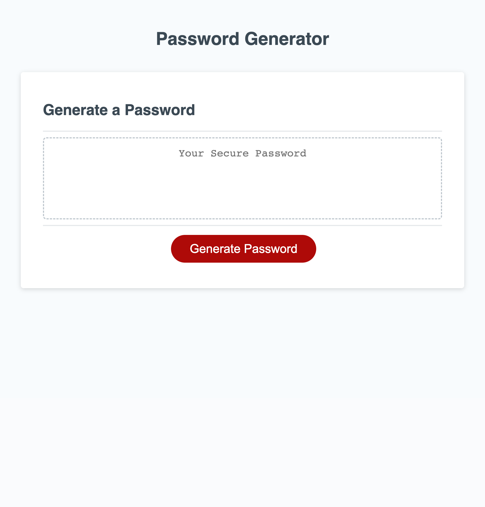

# Password-Generator

A password generator which asks the user how many characters the user needs, then it takes if the user wants lower case characters, upper case characters, numeric characters, or special characters. 

It sadly however comes with `[object HTMLTextAreaElement]` in front of the password and nothing I have tried manages to fix it.

[Password Generator](https://liamljhoward.github.io/Password-Generator/)

